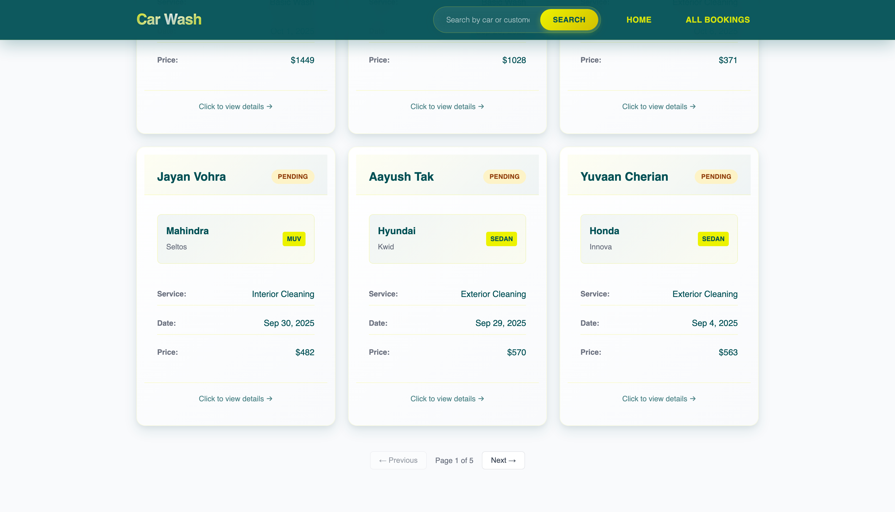
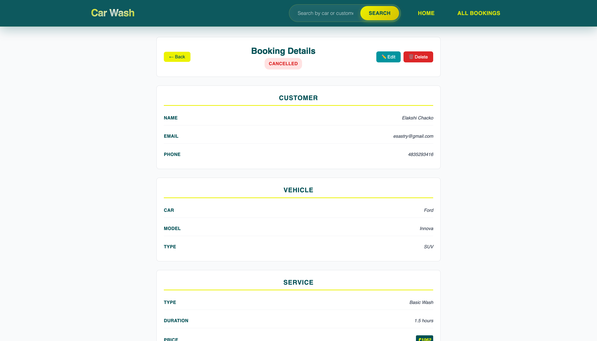
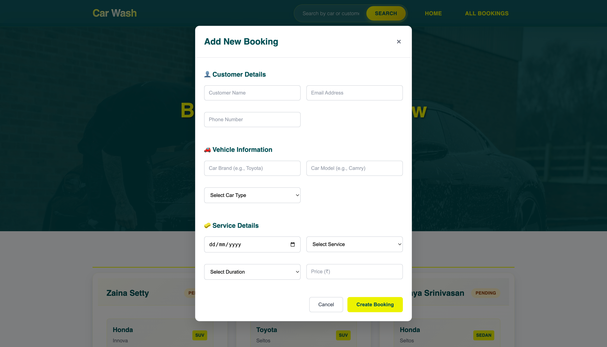
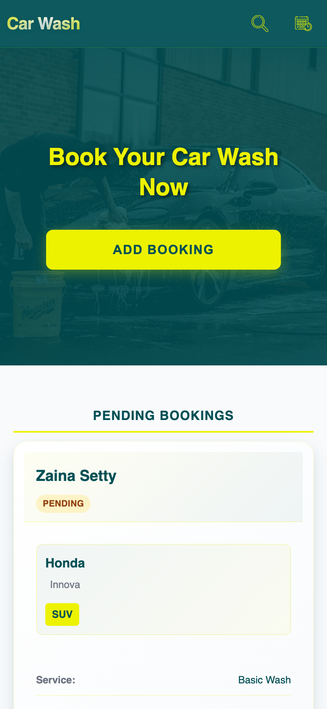
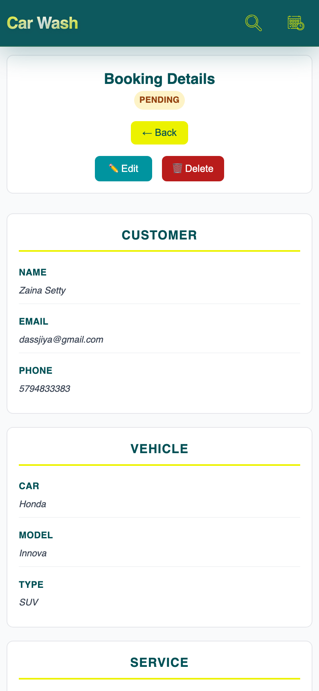
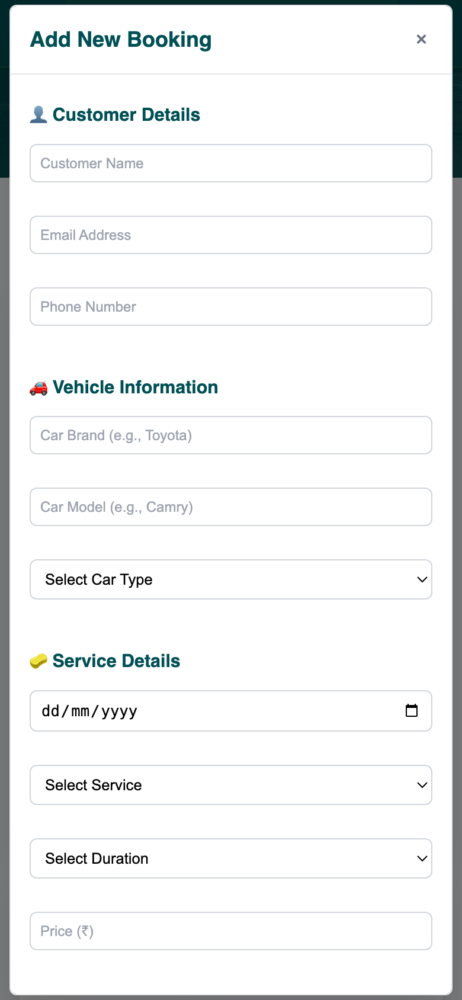
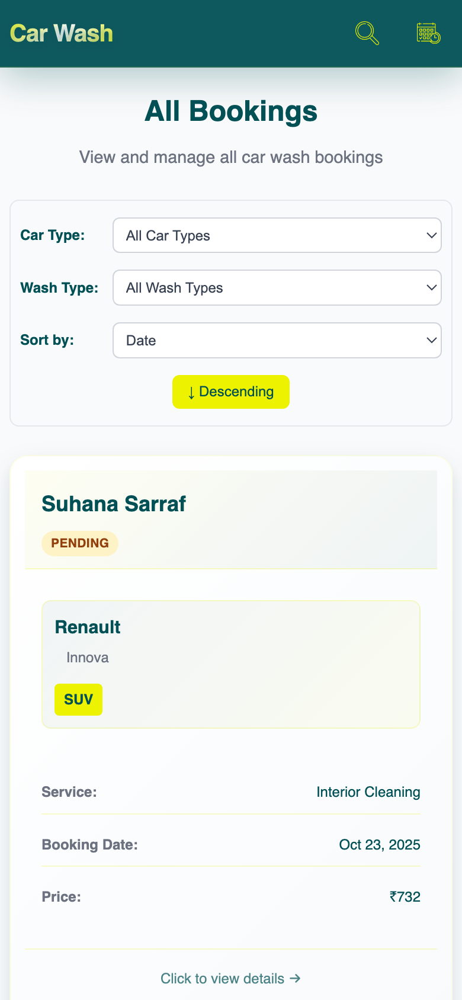

# Car Wash Booking System

## Description

This is a comprehensive full-stack car wash booking management system designed to streamline the booking process for car wash services. Built with modern web technologies, it provides an intuitive interface for managing customer bookings, tracking service status, and maintaining detailed records of all transactions.

The application features a responsive React frontend powered by Vite for fast development, paired with a robust Node.js/Express backend and MongoDB database for reliable data management. It supports complete booking lifecycle management from creation to completion, with advanced filtering, searching, and real-time updates.

## Features

- **Complete Booking Management**: Full CRUD operations for car wash bookings
- **Advanced Status Tracking**: Monitor booking lifecycle (Pending, Confirmed, Completed, Cancelled)
- **Smart Search & Filtering**: Search by customer or car name, filter by car type and wash type
- **Flexible Sorting**: Sort bookings by date, price, or other criteria
- **Responsive Design**: Fully responsive interface optimized for desktop, tablet, and mobile devices
- **Modern UI/UX**: Clean, intuitive interface with smooth animations and transitions
- **Real-time Updates**: Instant updates for booking modifications and status changes
- **Data Validation**: Comprehensive form validation for data integrity
- **Error Handling**: Robust error handling with user-friendly messages

## Tech Stack

### Frontend

- **React 18** with Vite for fast development and building
- **Tailwind CSS** for utility-first styling
- **React Router DOM** for client-side routing
- **Axios** for HTTP requests (if applicable)

### Backend

- **Node.js** with Express.js framework
- **MongoDB** with Mongoose ODM
- **CORS** for handling cross-origin requests
- **Dotenv** for environment variable management

## Folder Structure

```
carWashAssessment/
├── backend/
│   ├── db/
│   │   └── model.js          # MongoDB schema definitions
│   ├── routes/
│   │   └── bookingRoutes.js  # API endpoints for bookings
│   ├── .env                  # Backend environment variables
│   ├── index.js              # Express server setup
│   ├── package.json
│   └── package-lock.json
├── frontend/
│   ├── public/
│   ├── src/
│   │   ├── components/
│   │   │   ├── AddBookingForm.jsx    # Booking creation/editing form
│   │   │   ├── AllBookings.jsx       # Bookings list with filters
│   │   │   ├── BookingDetails.jsx    # Individual booking details
│   │   │   ├── Hero.jsx              # Home page with pending bookings
│   │   │   ├── Navbar.jsx            # Navigation component
│   │   │   └── *.css                 # Component styles
│   │   ├── App.jsx                   # Main app component
│   │   ├── main.jsx                  # App entry point
│   │   └── index.css                 # Global styles
│   ├── .env                          # Frontend environment variables
│   ├── package.json
│   ├── package-lock.json
│   ├── tailwind.config.js
│   ├── vite.config.js
│   └── index.html
└── README.md
```

## Environment Setup

### Backend (.env in backend/ folder)

```
MONGO_URI = "your_mongodb_connection_string"
PORT = 3000
CORS_ORIGIN = "your_local_frontend_string"
```

### Frontend (.env in frontend/ folder)

```
VITE_PORT = 3000
```

**Important**: The `PORT` in backend/.env and `VITE_PORT` in frontend/.env must be the same value (e.g., both set to 3000) for the frontend to communicate with the backend API.

## Installation & Setup

### Prerequisites

- Node.js (v16 or higher)
- MongoDB Atlas account or local MongoDB instance
- npm or yarn

### Backend Setup

```bash
cd backend
npm install
# Create backend/.env with your MongoDB URI and PORT
npm start
```

### Frontend Setup

```bash
cd frontend
npm install
# Create frontend/.env with VITE_PORT matching backend PORT
npm run dev
```

### Running the Application

1. Start the backend server: `cd backend && npm start`
2. Start the frontend development server: `cd frontend && npm run dev`

## API Endpoints

### Bookings

- `GET /api/bookings` - Get all bookings
- `GET /api/bookings/pending` - Get pending bookings
- `GET /api/bookings/:id` - Get booking by ID
- `POST /api/bookings` - Create new booking
- `PUT /api/bookings/:id` - Update booking
- `DELETE /api/bookings/:id` - Delete booking

### Search

- `GET /api/bookings/search?q=search_term` - Search bookings by car name or customer name

## Database Schema

### Booking Model

```javascript
{
  carName: String,
  carModel: String,
  carType: String,
  customerName: String,
  customerEmail: String,
  customerMobile: String,
  bookingDate: Date,
  carWashType: String,
  carWashDuration: String,
  carWashPrice: Number,
  status: String (pending/confirmed/completed/cancelled)
}
```

## Screenshots

### Home Page




### All Bookings


### Booking Details



### Form Booking



## Mobile Screenshots






## Live Link

[Car Wash Booking System](https://car-wash-eight.vercel.app/)
